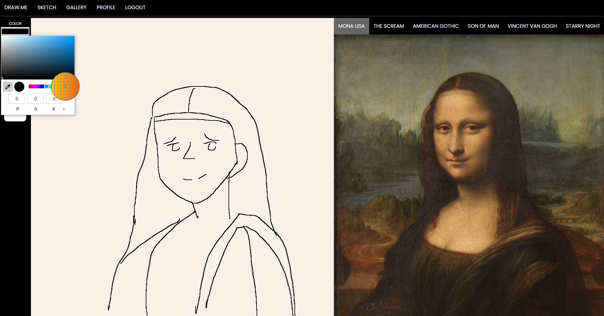
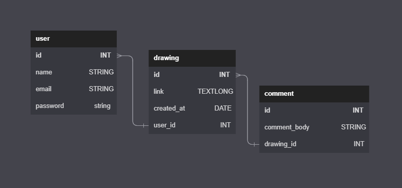

# DRAW.ME 👨‍🎨
BootCamp Project #2 - DRAW.ME

## INTRODUCTION

Have you ever wanted to show off your art skills? Don't know where to launch your career as an artist in the digital age? Introducing *Draw.me*, a community-based drawing platform where you can share your talent with friends and community. Draw.me provides world renowned paintings as models for you to practice your drawing skills. We also provide a social networking service where users can provide feedback and interact with another user's art. What are you waiting for? Sign up today to embark on an exciting creativity voyage.



## INSTALLATION

You can start drawing today by creating an account on our deployed website [here](https://draw-me.herokuapp.com/).

### TO RUN LOCALLY
1. Clone/download the code in this repo
2. Navigate to the location of the code downloaded in your terminal
3. Rename ".env.EXAMPLE" to ".env"
4. Input your mySQL password in .env
5. Run query found in db/schema.sql in your mySQL shell
6. Run the following command in your terminal (make sure you're in the root directory of the application)
```git
npm i && npm start
```
7. Navigate to localhost:3001 in your browser 

## TECHNOLOGY
### MySQL

Our server uses mySQL database to store users' confidential credentials, drawings, and comments. The following schema is used to show how each model references one another.



### Canvas
Our drawing application is engineered with the Canvas API. Canvas provides a means for drawing graphics via JavaScript and the HTML canvas element. 
You can learn more about Canvas by reading this [documentation](https://developer.mozilla.org/en-US/docs/Web/API/Canvas_API).
The main drawing JavaScript functionality can be examined with the following code:
```javascript
function start(e) {  // activate drawing by listening to a mouseclick down
  is_drawing = true;
  ctx.beginPath();
  ctx.moveTo(getX(e), getY(e));
  e.preventDefault();
}

function draw(e) { // start drawing on your mouse's coordinate spaces
  if (is_drawing) {
    ctx.lineTo(getX(e), getY(e));
    ctx.strokeStyle = stroke_color;
    ctx.lineWidth = stroke_width;
    ctx.lineCap = "round";
    ctx.lineJoin = "round";
    ctx.stroke();
  }
  e.preventDefault();
}

function stop(e) { // set drwaing state to false when user let go of mouse hold
  if (isDrawing) {
    ctx.stroke();
    ctx.closePath();
    isDrawing = false;
  }
  e.preventDefault();
  restoreArray.push(ctx.getImageData(0, 0, canvas.width, canvas.height));
  startIndex += 1;
}
```

### Tailwind CSS
Tailwind CSS makes it quicker to write and maintain the code of our application. By using this utility-first framework, we were able to provide a polished user interface for our customers:


### Sequelize and Express
By using Sequelize ORM, we were able to consistently store data such as drawings and comments by updating queries, so our Express server can respond back to user's requests. Our social network service is entirely built on this stack to retrieve, store, and render data back to our client.


## COLLABORATORS

[Brandon Villasenor](https://github.com/Nodnarbrones)

[John Lopez](https://github.com/Think-Again-Coder)

[Andy Liu](https://github.com/Tojomojo)

[Tyler Oats](https://github.com/Atlas548)

[Nhan Nguyen](https://github.com/nhanng19)

## Submission
This project was uploaded to GitHub at the following repository link:
[https://github.com/nhanng19/Draw.me](https://github.com/nhanng19/Draw.me)

Deployed Web Application Link:
[https://draw-me.herokuapp.com/](https://draw-me.herokuapp.com/)
